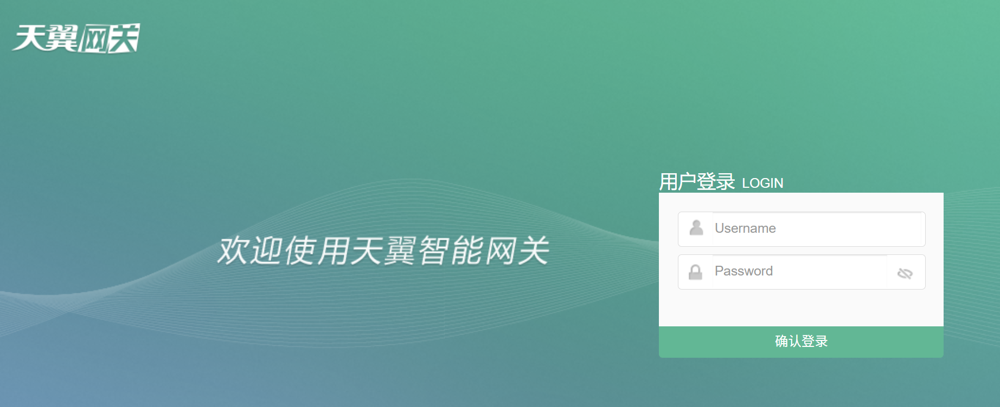
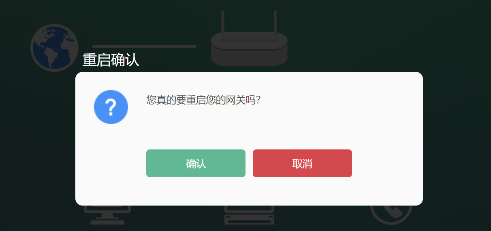

# auto_restart_modem

> Generally it will be used in China, so I only provide documentation in Chinese.

本项目提供了一种自动化重启光猫的方法。

## 适配情况

目前仅适配了电信 ZN-M180G，其界面如下：






如不是该型号的光猫，可以自行修改代码并发布。

## 原理

每隔一段时间 ping 给定的地址，如果都 ping 不通，则执行重启指令。

由于未知原因，无法通过 HTTP 请求重启，只能通过 Web UI 自动化的方式重启。

重启时会使用 Chrome / Chromium 及 chromedriver，所以可能要考虑资源占用问题。

## 执行

提供了两种方式：直接执行、容器化执行。

### 直接执行

下载项目，进入到项目目录。

复制 `.env.example` 到 `.env`：

```bash
cp .env.example .env
```

编辑 `.env`：

```ini
# 路由器地址
ROUTER_ADDR = 192.168.1.1
# 用户名，普通用户就行
USER_MANE = useradmin
# 密码
PASSWORD = password
# 检查连接用的地址，当给定的全部地址均无法访问时，才会重启光猫。请使用外部地址，多个地址用半角逗号,隔开
CHECK_ADDR_LIST = 4ading.com,www.baidu.com,bing.com
# 检查的间隔，以秒为单位
CHECK_INTERVAL = 180
```

安装 Python 依赖：

```bash
pip install -r requirements.txt
```

执行：

```bash
python check_network.py
```

### 容器化执行（本地构建）

下载项目，进入到项目目录。

复制 `.env.example` 到 `.env`，照上面的方式更改。

然后运行：

```bash
docker compose up -d
```

### 容器化执行（使用构建好的镜像，通过 Docker Compose 执行）

创建一个目录，放入 `.env` 文件（内容见上）和 `docker-compose.yml` 文件如下：

```yaml
version: "3"

services:
  auto_restart_modem:
    env_file:
      - .env
    image: dingjunyao/auto_restart_modem:latest
    # 也可以是 ghcr.io/dingjunyao/auto_restart_modem:latest
    container_name: auto_restart_modem
    restart: unless-stopped
    command: python3 check_network.py
```

然后运行：

```bash
docker compose up -d
```
